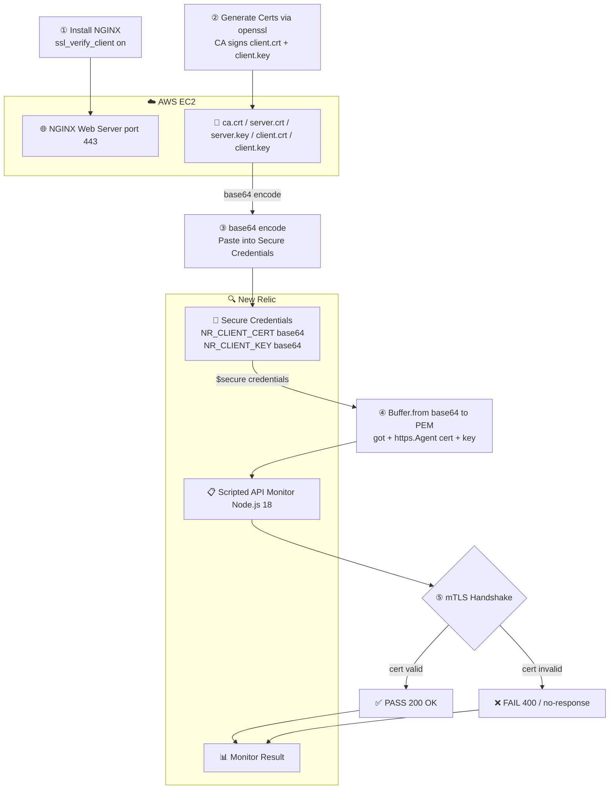

# synthetic_monitoring

An EC2 instance runs NGINX configured for mutual TLS (mTLS). This means both the server and the client must present a valid certificate during the TLS handshake. Any request without a valid client certificate is rejected before it reaches the application layer.
Certificate Structure



## Part 1 — EC2 NGINX Web Server

### Overview
Three certificates are generated using openssl, all signed by a self-signed CA:
FilePurposeca.crtCertificate Authority — signs all other certsserver.crt / server.keyNGINX server identityclient.crt / client.keyClient identity — given to New Relic
NGINX Configuration.

The key directive is ssl_verify_client on which enforces mTLS:
```
nginxserver {
    listen 443 ssl;
    server_name localhost;

    ssl_certificate        /etc/nginx/certs/server.crt;
    ssl_certificate_key    /etc/nginx/certs/server.key;

    # mTLS — only clients with a cert signed by our CA are allowed
    ssl_client_certificate /etc/nginx/certs/ca.crt;
    ssl_verify_client      on;

    location /health {
        default_type application/json;
        return 200 '{"status":"ok","client":"$ssl_client_s_dn"}';
    }
}
```

### Setup
bashbash ec2-setup.sh

This script will:

- Install NGINX and openssl
- Generate the CA, server, and client certificates
- Write the NGINX config and restart the service
- Run two curl tests to verify mTLS is working
- Print the base64-encoded client cert and key ready to paste into New Relic

Verify Locally

```
### With client cert — expect 200
curl -s \
  --cert /tmp/client.crt \
  --key  /tmp/client.key \
  --cacert /tmp/ca.crt \
  https://localhost/health
```

### Without client cert — expect 400

```
curl -s --cacert /tmp/ca.crt https://localhost/health
```

EC2 Security Group

- Ensure port 443 must be open inbound to allow New Relic synthetic runners to reach the endpoint. 
- New Relic publishes their IP ranges per location at:
https://docs.newrelic.com/docs/synthetics/synthetic-monitoring/administration/synthetic-public-minion-ips/

## Part 2 — New Relic Secure Credentials

New Relic Secure Credentials store sensitive strings that can be referenced inside monitor scripts as $secure.<KEY>. 

- The certificate and key are stored as base64 strings because Secure Credentials only accept text values.
- Store the Credentials
- Go to New Relic UI → Synthetics → Secure Credentials
- Click Create credential and add:

KeyValueNR_CLIENT_CERTbase64 output of client.crtNR_CLIENT_KEYbase64 output of client.key

The base64 values are printed at the end of ec2-setup.sh. Use -w 0 flag when encoding 
to ensure no line breaks in the string:
```
bashbase64 -w 0 /tmp/client.crt
base64 -w 0 /tmp/client.key
```
*New Relic have a max of 10000 char*

## Part 3 — New Relic Synthetic Monitor

### Overview
A Scripted API Monitor runs JavaScript on New Relic's infrastructure on a schedule. The script reads the base64 credentials, decodes them to PEM in-memory, and uses Node's native https module to make an mTLS request to the EC2 endpoint.
Create the Monitor


- Go to New Relic UI → Synthetics → Monitors → Create monitor
- Select Scripted API
Configure:
```
SettingValueNamemTLS Health CheckRuntimeNode.js 22.xInterval5 minutesLocationAWS AP Southeast (or your preferred region)

Paste the contents of synthetic-monitor.js into the script editor
Update the endpoint to your EC2 public IP:

jsconst ENDPOINT = 'https://YOUR_EC2_PUBLIC_IP/health';

Click Validate to run a test — the output log should show ✓ PASS - mTLS authenticated

Click Save monitor
```
How the Script Works
```
$secure.NR_CLIENT_CERT (base64 string)
  → Buffer.from(..., 'base64').toString('utf8')
  → PEM string in memory
  → https.Agent({ cert, key })
  → HTTPS request to EC2
  → 200 OK = PASS / anything else = FAIL
The base64 decode happens entirely in memory — no temp files are written inside the New Relic runtime sandbox.
```

Files

- FileDescriptionec2-setup.sh
- Sets up NGINX with mTLS on EC2, 
- generates all certs, 
- prints base64 credentialssynthetic-monitor.js
- New Relic Scripted API monitor scriptShare

## Generate a new certificate 
- Generated a new server key + CSR with CN="\<domainName>"
```
openssl genrsa -out /tmp/<domainName> 2048
```
- Added SAN (DNS:\<domainName>, IP:\<IP_ADDRESS>) so modern TLS clients validate correctly
```
/etc/nginx/sites-enabled/default 
server {
    listen 443 ssl;
    server_name <domainName>;
 
    ssl_certificate        /etc/nginx/certs/server.crt;
    ssl_certificate_key    /etc/nginx/certs/server.key;
 
    # mTLS - reject anyone without a cert signed by our CA
    ssl_client_certificate /etc/nginx/certs/ca.crt;
    ssl_verify_client      on;
 
    location /health {
        default_type application/json;
        return 200 '{"status":"ok","client":"$ssl_client_s_dn"}';
    }
}
 
# Port 80 - reject with 400 (no plain HTTP)
server {
    listen 80;
    return 400 "TLS required";
}
```
- Signed it with your existing CA
```
sudo openssl x509 -req -in /tmp/order-api.csr \
  -CA /etc/nginx/certs/ca.crt -CAkey /etc/nginx/certs/ca.key -CAcreateserial \
  -out /tmp/order-api.crt -days 365 \
  -extensions v3_alt -extfile /tmp/san.ext
```


- Deployed to /etc/nginx/certs/ and reloaded nginx
```
sudo systemctl reload nginx
```


# Notes:
JavaScript use [GOT](https://github.com/sindresorhus/got) and please note that New Relic Runtime don't use version v12+ as this version will use ESM (ECMA Script Module) which is not supported in NewRelic Runtime