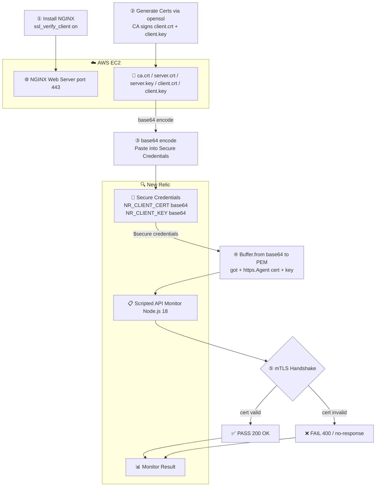

# synthetic_monitoring

```mermaid
flowchart TD
    subgraph EC2["☁️ AWS EC2"]
        NGINX["🌐 NGINX Web Server port 443"]
        CERTS["📜 ca.crt / server.crt / server.key / client.crt / client.key"]
    end

    subgraph NR["🔍 New Relic"]
        SC["🔐 Secure Credentials\nNR_CLIENT_CERT base64\nNR_CLIENT_KEY base64"]
        SM["📋 Scripted API Monitor Node.js 18"]
        RES["📊 Monitor Result"]
    end

    STEP1["① Install NGINX\nssl_verify_client on"]
    STEP2["② Generate Certs via openssl\nCA signs client.crt + client.key"]
    STEP3["③ base64 encode\nPaste into Secure Credentials"]
    STEP4["④ Buffer.from base64 to PEM\ngot + https.Agent cert + key"]
    STEP5{"⑤ mTLS Handshake"}

    PASS["✅ PASS 200 OK"]
    FAIL["❌ FAIL 400 / no-response"]

    STEP1 --> NGINX
    STEP2 --> CERTS
    CERTS -->|base64 encode| STEP3
    STEP3 --> SC
    SC -->|$secure credentials| STEP4
    STEP4 --> SM
    SM --> STEP5
    STEP5 -->|cert valid| PASS
    STEP5 -->|cert invalid| FAIL
    PASS --> RES
    FAIL --> RES
```